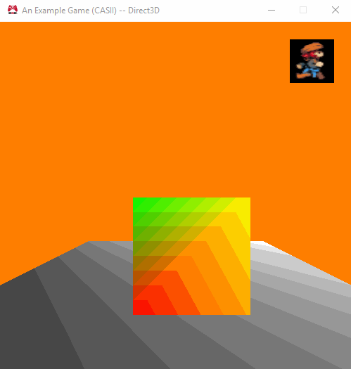

# Assignment 10
### That was easier than I thought!

In this assignment we had to update our engine to now load mesh assets from file!  Specifically, we had to design a mesh file format in Lua, create a MeshBuilder project to "build" these asset files, update the engine to treat meshes as managed assets, and update our ExampleGame to use Mesh Handles instead of pointers directly.

## Purpose

The apparent purpose of this assignment was to make our engine slightly more data driven.  Having meshes defined programmatically in code can be useful for testing (or even procedurally generating meshes), but it makes it rather hard to iterate on a game.  One would have to recompile the engine everytime they wanted to update a singular mesh.  That can be highly inefficient!

The obvious answer to this problem is to make meshes loadable from asset files.  This allows us to modify the mesh outside of the code for the game and speeds up iteration.

## The Assignment

As I mentioned above, there were four things that had to be done this assignment: Create a Mesh Format, Create a MeshBuilder Project, Update the Mesh Class to be a Managed Asset, and Update the ExampleGame Project to use Mesh Handles.

### Mesh Format

The first task to attend to was to create a lua-based Mesh File Format.  The best way to explain what the format that I came up with is is to use an example.  Here is the Mesh File, `floor_plane.lua`, that defines the square floor plane in my game:

``` lua
--[[
	Mesh: Floor Plane
	Author: Cornelia Schultz
	Generated: November 4, 2017 at 15:45 MDT
]]

return
{
	-- Index Buffer Contents
	-- Authored Meshes are Right-Handed!!
	indices =
	{
		0, 1, 2, -- Tri 0
		0, 2, 3, -- Tri 1
	},
	
	-- Vertex Buffer Contents
	vertices =
	{
		{ -- Index 0
			position = {-1, 0, 1},
			color = {0, 0, 0, 1},
		},
		{ -- Index 1
			position = {1, 0, 1},
			color = {0.5, 0.5, 0.5, 1},
		},
		{ -- Index 2
			position = {1, 0, -1},
			color = {1, 1, 1, 1},
		},
		{ -- Index 3
			position = {-1, 0, -1},
			color = {0.5, 0.5, 0.5, 1},
		},
	},
}

```

This seemed to be the best way to format the Mesh File from my perspective.  The first thing that it has is a header.  This header will identify the name of the mesh, the author, and the date it was generated.  If using a tool like Maya (which we will be in a future project) this data would be automatically populated in the header.

The real meat of the format begins inside of the `return` block.  The first thing that is listed are the triangle indices.  There's a couple of comments to let the user know that these are the Index Buffer Contents and that they are **right-handed**.  This is important.  While the binary format of the mesh (mentioned below) is in the format appropriate for a particular platform, authored mesh files like this must be right handed.

In addition to the comments, the attribute in the table is named `indices` just to make it clear.  The comments are really just reinforcing this.  Eact triangle is listed on its own line with a comment indicating the index of the triangle itself.  This will make debugging large meshes easier as they may have hundreds of triangles or more!

The vertex buffer data follows a similar format with descriptive comments and attribute names.  It, however, contains sub-tables which each define a singular vertex.  Each sub table is annotated with the index of the vertex to make identifying them in a long list easier.  It may seem silly for such a small mesh since you can look at each set of vertex data and tell what its index is, but in a mesh with hundreds of vertices this system will make it easy to identify vertices without having to count hundreds of lines.

I chose to make the `position` and `color` sub-sub-tables not use key-value pairs.  This is mainly to save the eyes from seeing so much redundant data as I feel it is easy enough to interpret a list of three numbers as "x, y, z" (for `position`) and a list of four as "r, g, b, a" (for `color`).

#### But why?

All in all, having a human-readable Mesh File format makes debugging easier.  In fact, having human readable asset files in general makes debugging easier.  If there's something off with a vertex and you just want to see if perchance its the color value or position you don't have to open a complex program to do so.  You can open the readable format in a text editor and scroll through it quickly to try and get a quick answer.

Also, while not necessarily the main reason for having human-readable assets, this could aid in iteration as a Mesh wouldn't have to be opened in a complex software just to tweak a vertex or change a color value (or any other data associated with that vertex).  This is less likely to happen, though, for extremely complex meshes.. but for simple games this approach might be the best!

### MeshBuilder Project

The second task was to create a Tools Project to "build" our meshes.  This project was supposed to, for now, simply copy the lua mesh files into the output directory for use in the game as lua code.  Ideally, the lua code would be used to produce a binary file that could be loaded easily and quickly at runtime...

And since I'd have to write the lua code for reading the mesh file anyways.. I decided to go ahead with doing a binary format right away...  And it was surprisingly easy!  The standard library really makes it simple to read and write arrays of data to disk.  (There were some file IO functions in the Platform Project in the engine.. but they were not appropriate as I needed to read and write three distinct chunks of data per mesh and the Platform function only supported reading the entire file as a whole.)

One nice thing came about from implementing the binary format early, and that was the ability to remove the index reversal code from `cMesh.d3d.cpp`.  The indices are now reversed for D3D (from a right-handed space to a left-handed space) in the MeshBuilder instead of during runtime.  The result is that loading meshes on either OpenGl or D3D platforms do approximately the same operations, and, theoretically, should have similar time costs.

### Engine Updates

The third task was to update the mesh class in engine to be a managed asset.  This basically involved creating a static Asset Manager of "Mesh" type and creating a `Load` function for the mesh to load the asset from file.  The load function was, again, surprisingly easy to create as the standard library functions for file streams make reading arrays of data very easy.

I was also able to preserve the MeshBuilder class (not the Project) from previous assignments that allows one to define a mesh programmatically.  (In fact, it's used by the `Load` function to build the Mesh read in from file.)  This will allow Meshes to be loaded from file using the `Load` function or to be created programmatically if doing something procedural like heightmap-based terrain generation.

### ExampleGame Project Updates

The final task of the assignment was to update the ExampleGame project to use `Mesh::Handle`s instead of pointers.  There was also the need to remove the old initialization and deinitialization of mesh code since that data was now being loaded from file.  This was really easy to do as it simply involved following the pattern done with loading the Texture Handles.  All in all, this task simplified the code for the ExampleGame project immensely (as a good 50-100 lines were creating meshes before).

## Wrapping Up

Not much has changed from the user's perspective since the last assignment.  One can look in the `data` folder in the release archive and see the binary meshes.  (You might have to use a hex editor to see the data;  I haven't explained the format since I expect that it may change in a future assignment or I might have to do that explanation there.)  Still.. here's a gif and a url:



[Windows - Release - Direct3D](https://github.com/CorneliaXaos/EAE6320-WriteUps/releases/download/a10/Assignment10.zip)

### Controls

You can use the following controls to:

* Translate The Camera
  * **W** and **S** will move the camera forward and backward.
  * **A** and **D** will strafe the camera left and right.
  * **Q** and **E** will strafe the camera down and up.
* Rotate The Camera
  * **I** and **K** will rotate the camera about the x-axis (pitch).
  * **J** and **L** will rotate the camera about the y-axis (yaw).
  * **U** and **O** will rotate the camera about the z-axis (roll).
* Translate the Cube
  * The **Up** and **Down** arrow keys will translate along the World Space y-axis.
  * The **Left** and **Right** arrow keys will translate along the World Space x-axis.
  * The **Page Up** and **Page Down** keys will translate along the World Space z-axis.
* Reset the Camera
  * Press **R**!
  
Enjoy!
