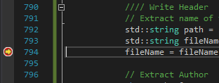

# Assignment 11
### Now with ADVANCED GEOMETRY.

In this assignment we had to integrate and complete a new project:  "MayaMeshExporter".  This project would be used to generate a Maya 2018 plugin for exporting models to our custom mesh format.  Most of the project was ready to go; we only had to complete a few bits of code to get it to output our format correctly.

Additionally, we needed to add UV / mesh texturing support to our game engines so that we can display textured meshes.  This was pretty easy relative to the Maya plugin code.

## Purpose

The purpose of this assignment was to refine our asset import pipeline slightly.  We have the support for externally defined meshes.. but these would need to be hand-authored.. and that's fine for small meshes.. but, like the "Rainbow Helix" mesh in the release below demonstrates, even simple and geometrically "primitive" meshes may have hundred of indices and vertices..  The solution to this problem was to create a plugin for a modeling suite, like Maya, for exporting directly to our custom mesh format.

As to the mesh texturing.. well..  it will make it easier to make nice looking meshes!  So it was almost (literally) the icing on the cake (mesh). :P

## The Assignment

### MayaMeshExporter Project

This part was simple enough, really.  It mostly involved going through and filling in code in a few places to set up some Maya properties and to actually export the mesh.  That latter bit was fun as I had to figure out how to get a few bits of information like the username of the person exporting the mesh and the current date / time in a readable format...

Some debugging was required, though.  There was some unusual glitch I was having where my indices weren't being exported correctly (I forgot to multiply something by 3) and I found it while debugging.  (And as per submission requirements, here's some proof that I could, indeed, debug the plugin while it was running in Maya.)

(I'm extracting the name of the mesh from the file name in that picture.)

To fulfill additional requirements (because I can't think of an elegant way to weave it into discussion):

I only had one reference I needed to add to the MayaMeshExporter.. and that was the "Advapi32.lib" Windows library to get access to the `GetUserName` function.  The MayaMeshExporter did not need any references to any projects in our solution; only the Maya code base (and this was set up in the project files we received via environment variables).

No other projects in the solution depend on the exporter.  Because of this, building either the Example Game assets or the Example Game project will not build the exporter.  The exporter must be built via a `Build Solution` command or by building it directly.

Finally, I only exported the used information in our engine:  position, color, and uvs.  I didn't export the normal, tangent, or bitangent data as I had no use for them.  I could have exported them and the MeshBuilder project would have ignored that data appropriately, but that would have required writing more Lua code.. that I would rather not write until I have need to.

### UV Support

This was extremely easy to do as it involved touching most of the same code I've been working with for a while now.  The first task was to update some code in the Graphics project to add a third type of vertex data to the Mesh class.  Additionally, the Graphics namespace submission function for meshes had to be updated to take a texture object so that one could be bound if it were provided.

The second step was to update the shaders to process the third set of vertex data (the UV coordinates).  Again, the infrastructure we've set up in previous assignments made this really easy.  I also had to create a new Mesh shader that would render meshes as a sampled texture multiplied by their vertex color.

Finally, the Example Game project had to be modified to use the new mesh (the Rainbow Helix) and to submit meshes in the new, "correct" way; that is, providing a texture or a `nullptr` if the MeshJob should not bind a texture.  This allowed me to keep the plain "vertex-colored" shaders around and still have both working in the same scene.

## Wrapping Up

As usual, here's an animated gif of the scene in progress.  Check out that Helix. :P It has some ~500 triangles..  That would have been a **pain** to make by hand.. but the MayaMeshExporter made it simple.. Maya even does the hard work of generating the helix!  I just had to color it.

(I forgot to use the movement keys when recording that gif, but you can move the helix around using the translation keys previously used to control the cube.)

[Windows - Release - Direct3D](https://github.com/CorneliaXaos/EAE6320-WriteUps/releases/download/a11/Assignment11.zip)

### Controls

You can use the following controls to:

* Translate The Camera
  * **W** and **S** will move the camera forward and backward.
  * **A** and **D** will strafe the camera left and right.
  * **Q** and **E** will strafe the camera down and up.
* Rotate The Camera
  * **I** and **K** will rotate the camera about the x-axis (pitch).
  * **J** and **L** will rotate the camera about the y-axis (yaw).
  * **U** and **O** will rotate the camera about the z-axis (roll).
* Translate the Helix
  * The **Up** and **Down** arrow keys will translate along the World Space y-axis.
  * The **Left** and **Right** arrow keys will translate along the World Space x-axis.
  * The **Page Up** and **Page Down** keys will translate along the World Space z-axis.
* Reset the Camera
  * Press **R**!
  
Enjoy!
