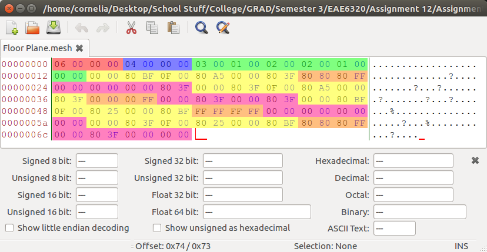

# Assignment 12
### I had a head start.

In this assignment we had to change the Graphics project and MeshBuilder projects so that meshes were built as Binary Files and the Graphics project loaded Binary encoded mesh data...  wait..  I did that already!  Still, I had a few things that needed to be cleaned up and made better.

Additionally, we'd need to benchmark our data (only a couple of timing function calls) and present some information on how inefficient loading and processing the Lua file was compared to loading the binary mesh.

## Purpose

Ultimately, this assignment's purpose was to make mesh loading nice and sprightly.  Lua is nice for human readable and editable data, and it does serve some purpose in the final product (user settings are implemented using Lua), but it isn't the fastest.. as the benchmarks below show.  Thus, using a binary format to encode the mesh files makes the most sense.. and solves several other problems I encountered in previous assignments!

## The Assignment

The first task in the assignment was to refactor the code so that the MeshBuilder project processes Lua mesh files into binary mesh files.  Additionally the Graphics project would need to read and process these binary files.. and this is where I had already completed most of the work!  Still, I had to perform a bit of code refactoring in the binary mesh loading code to satisfy the assignment's requirements.

### Binary Mesh Format

To start things off, here's a screenshot of the `Floor Plane.mesh` binary file as viewed inside a hex editor:



| Data Type    | Color  |
| ------------ | ------ |
| Index Count  | Red    |
| Vertex Count | Blue   |
| Indices      | Green  |
| Position     | Yellow |
| Color        | Orange |
| UVs          | Purple |

As you can see I've nicely color coded the relevant data.  The first two bits of data, the red and blue, are the binary format's "header".  Specifically, those two integer values contain the number of indices (red) and vertices (blue) that the entire file contains.  This is needed in order to accurately extract the blocks of data.

The large green section contains each index.  Every pair of hex values is a single index (since indices are encoding as 16-bit integers).

Finally, the rest of the data belongs to the vertices.  I've sectioned off each bit of encoded data:  the position data is encoded as 3 floating point values and is highlighted in yellow; the color data is encoded as four 8-bit integers and is highlighted in orange; finally, the UV data is encoded as two floating point values and is highlighted in purple.

#### Advantages of Binary Formats

Binary formats have numerous advantages over the more verbose human-readable ones.  For starters, they are considerably smaller since they lack the markup to declare what each section of data signifies.  I had to include that above in the binary image by highlighting the data.  A readable format would have text to demarcate the sections of data while a computer would just "know" / "assume" what the data is.. which is one reason why using Binary data can be dangerous (i.e. processing incorrect / bad data).

As a consequence of being smaller, binary data loads faster.  Considerably faster as the benchmarks below will indicate.  With binary formats one is essentially loading the data directly into memory in a ready-to-use state.  With human-readable formats the data first has to be processed to remove all the extra data that exists solely for humans.

Finally, data can be curated to platform.  If there are differences between platforms (such as the winding order of triangles and the definition of the UV coordinate space in OpenGL and Direct3D) different binary files can be produced for each platform to remove runtime processing.  This means that the binary files used by the OpenGL version of our engine are **not** the same as the ones used by the Direct3D implementation.  This is because the MeshBuilder project outputs data that the platform expects so that the runtime does not have to perform any processing (such as reversing a winding order or correcting a UV coordinate).

#### Advantages of Human-Readable Formats

The obvious advantage of human-readable formats is that they are just that:  readable.  This means that the average person should be able to open one of these formats and look through it and know what the data signifies.  If you open the Binary format, however, without some kind of underlying knowledge of the system it will be rather difficult to determine what is going on in there.

This readability can also lend itself to User-Generated-Content support.  I know of many games that have human-readable assets so that it is easy for players to hack and mod the game.  I know of a few more that leverage Lua for actual game logic as well.  So binary files are not always the solution (though they don't necessarily impede User-Generated-Content).

#### Our Setup

In our engine we pick and choose where we use what kinds of files.  For debugging and development purposes, human-readable data is a must.  This kind of data allows content creators and designers to figure out what's going on with their data when it's being used in engine.  It also allows them to tweak finite values if they choose to do so (though that may be a bit of a Herculean task..).  (The game actually runs using the binary format in development as well, but when you try to execute the product from within Visual Studio it will rebuild the assets to ensure they are up-to-date; in a future assignment we'll only rebuild assets that have changed.)

When it comes time to release a product built on our engine, however, we choose to use binary data.  We want the game to run as fast as possible and load quickly.  Because of this we export our data to binary files so that it can be loaded as quickly as possible and put to use in the game.

### Binary Extraction

The following code is how I extract binary data to load it into a mesh:

``` c++
cResult Mesh::Load(const char* const i_path, Mesh*& mesh)
{
	auto result = Results::Success;

	Platform::sDataFromFile rawData;
	std::string errorMessage;
	if (!(result == Platform::LoadBinaryFile(i_path, rawData, &errorMessage))) {
		EAE6320_ASSERTF(false, "Failed to load file data!");
		Logging::OutputError("Unable to open Mesh File: %s", errorMessage);
		goto OnExit;
	}
	uintptr_t data = reinterpret_cast<uintptr_t>(rawData.data);

	// Declare data we're going to "read"
	uint32_t* header;
	uint16_t* indices;
	VertexFormats::sMesh* vertices;
	size_t offset = 0;

	// Acquire header
	{
		constexpr size_t headerSize = sizeof(uint32_t) * 2;
		if (rawData.size < headerSize) {
			result = Results::InvalidFile;
			EAE6320_ASSERTF(false, "File too small to have header!");
			Logging::OutputError("Unable to read header from Mesh File: %s", i_path);
			goto OnExit;
		}
		header = reinterpret_cast<uint32_t*>(data);
		data += headerSize;
		offset += headerSize;
	}

	// Acquire Indices
	{
		constexpr size_t indexSize = sizeof(uint16_t);
		const size_t indicesSize = indexSize * header[0];
		if (rawData.size < offset + indicesSize) {
			result = Results::InvalidFile;
			EAE6320_ASSERTF(false, "File too small for declared count of indices!");
			Logging::OutputError("Unable to read indices from Mesh File: %s", i_path);
			goto OnExit;
		}
		indices = reinterpret_cast<uint16_t*>(data);
		data += indicesSize;
		offset += indicesSize;
	}

	// Acquire Vertices
	{
		constexpr size_t vertexSize = sizeof(VertexFormats::sMesh);
		const size_t verticesSize = vertexSize * header[1];
		if (rawData.size < offset + verticesSize) {
			result = Results::InvalidFile;
			EAE6320_ASSERTF(false, "File too small for declared count of vertices!");
			Logging::OutputError("Unable to read vertices from Mesh File: %s", i_path);
			goto OnExit;
		}
		vertices = reinterpret_cast<VertexFormats::sMesh*>(data);
		data += verticesSize;
		offset += verticesSize;
	}

	// Sanity check
	if (rawData.size != offset) {
		Logging::OutputMessage("Mesh file contains extra, unused data: %s", i_path);
	}

	// Build Mesh
	mesh = new Mesh{};
	if (!(result = mesh->Create(indices, header[0], vertices, header[1]))) {
		delete mesh; // cleanup
		EAE6320_ASSERTF(false, "Failed to build mesh for file: %s", i_path);
		Logging::OutputError("Failed to build mesh for file: %s", i_path);
		goto OnExit;
	}

OnExit:
	rawData.Free();
	return result;
}
```

There's a lot going on in there, but basically I read the data in all at once using the Platform project.  Following that, I step through the memory extracting pointers to the correct data for the header, indices, and vertices.  Finally, if all goes well, I can create a new mesh *using the loaded data directly*.  No processing needed to be done.

### Benchmarking

Finally, we had to do a little rudimentary benchmarking for our submission.  To get a more accurate picture of the data, we had to create a complex mesh that contained data just near the limit that our system could handle (approximately 65536 vertices).  Here is the data I collected:

| Data Type | Format Type | Value                     |
| --------- | ----------- | ------------------------- |
| File Size | Lua         | 6.76 MB (7,094,412 bytes) |
|           | Binary      | 1.31 MB (1,375,508 bytes) |
| Load Time | Lua         | 0.231779 seconds          |
|           | Binary      | 0.000745 seconds          |

Firstly, the binary file was just about a fifth of the size of the Lua (human-readable) format.  Since assets tend to be the biggest contributors to the size of the final distributable, reducing the size of the assets by a factor of 5 is quite beneficial.. but this is nothing compared to the load time below.

The binary data loads (approximately) **three orders of magnitude faster** than the Lua data.  From a quarter of a second to load one mesh to less than a single millisecond..  That is a considerable performance boost and the most telling reason to use binary data over human-readable data where possible.  If your game has hundreds of assets to load and they're decently sized you will face extreme loading times if your data is not organized in a way that makes it easy to be consumed by the software.

## Wrapping Up

And here's the gif.  The Rainbow Helix has been replaced by an asset from my Thesis project (created by another person on my team, in a different class).


[Windows - Release - Direct3D](https://github.com/CorneliaXaos/EAE6320-WriteUps/releases/download/a12/Assignment12.zip)

### Controls

You can use the following controls to:

* Translate The Camera
  * **W** and **S** will move the camera forward and backward.
  * **A** and **D** will strafe the camera left and right.
  * **Q** and **E** will strafe the camera down and up.
* Rotate The Camera
  * **I** and **K** will rotate the camera about the x-axis (pitch).
  * **J** and **L** will rotate the camera about the y-axis (yaw).
  * **U** and **O** will rotate the camera about the z-axis (roll).
* Translate the Brain-Creature-Thing...
  * The **Up** and **Down** arrow keys will translate along the World Space y-axis.
  * The **Left** and **Right** arrow keys will translate along the World Space x-axis.
  * The **Page Up** and **Page Down** keys will translate along the World Space z-axis.
* Reset the Camera
  * Press **R**!
  
Enjoy!
