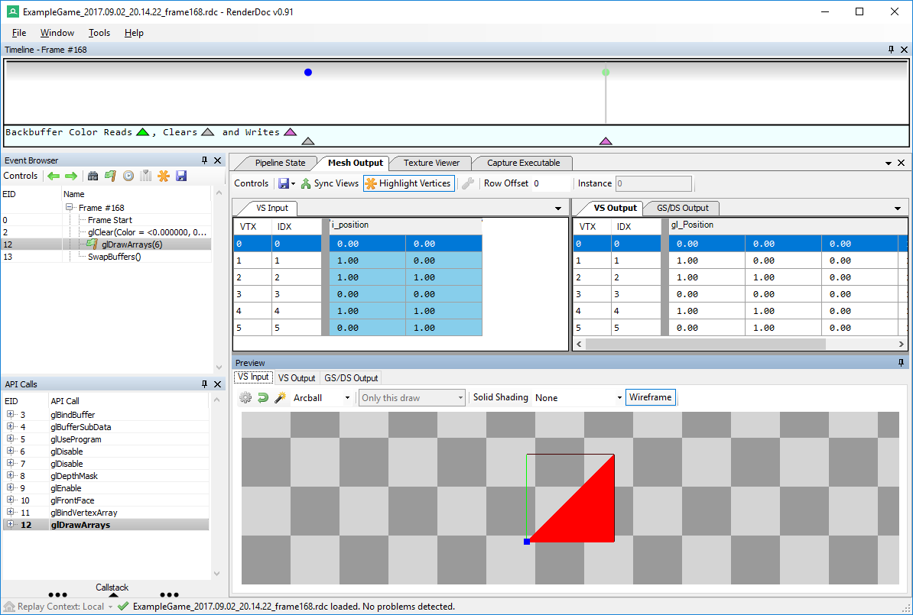

# Assignment 2
### In which coding happens!

Assignment 2's goals were not much more difficult than Assignment 1's, but had a larger portion of programming to be done.  The objectives were to abstract out from the platform specific Graphics implementations an "Effect" class and a "Sprite" class.  Additionally, I had to create three "new" shaders for use by the Sprite class exclusively.  Finally, I had to demonstrate an understanding of the ability to debug graphics programs via GPU Capture toolsets.

## Purpose

I feel that the ultimate goals of this assignment were to become more familiar with creating cross-platform code and to begin setting up the Graphics Project to do more than render pre-defined geometry to the screen.  In creating the classes, `Effect` and `Sprite`, we would learn how the common components of the platform specific graphics implementations could be reduced to more modular constructs.

Additionally, we'd work with Shaders a little more (albeit the assignment only required copying the existing "example" shaders to create versions for sprite use only).  Still, things could potentially go wrong so we also had to use GPU Capturing toolsets to demonstrate (at least somewhat) an ability to debug shader programs.  (I actually used the Visual Studio graphics debugger during Assignment 1 to figure out why my triangle wasn't drawing..  I had gotten the winding wrong.)

## Code Abstraction and Refactoring

As I mentioned, we had to make an `Effect` class whose purpose would be to encapsulate "Shader Data".  Essentially, I wrote a wrapper for Graphics Implementation specific "Shader Programs".  It's basic purpose is to configure the programmable pipeline (and the state based options on the Graphics card) before making any draw calls.

The interface I created is extremely simple and composed of only three public methods, `Create`, `Bind`, and `Destroy`.  They do things that should be obvious from their names, though the 'Bind' terminology might only be familiar to you if you've worked with Graphics programming before.  The interface, actually, reminded me of [another interface](https://github.com/cemyuksel/cyCodeBase/blob/acfce8fa9b64cace7408d857fb402cb70476a9e7/cyGL.h#L706) I used quite a bit in a previous class.  I expect to see some more similarities between the evolution of this project and [cyCodeBase](http://www.cemyuksel.com/cyCodeBase/) as the class progresses.

As to the `Sprite` class, it is essentially a wrapper around the geometry required to render a "quad" to the screen.  The professor mentioned using it for UI, but it could also potentially be used for 2D gaming if one wanted to.

The `Sprite` class's interface is as simple as the `Effect` class and consists of three methods, of which the `Create` and `Destroy` share names and purposes.  The differentiating function is called `Render` and is used to actually send the geometry data to the GPU for processing (presumably after a call to `effectInstance.Bind()`).

All in all, what was once tens of lines in each platform specific implementation class was reduced to the following, ridiculously simple, calls to render the quad to the screen:

``` c++
s_effect.Bind();
s_sprite.Render();
```

This is not mentioning, of course, the hundreds of lines of initialization and cleanup code that were reduced to one-liner calls as well.  Yay for encapsulation!

## Creation of "New" Shaders

This should have been simple and taken no time at all.. but I actually spent quite a bit of time on this section of the assignment than I needed to, but not for reasons you might be thinking.  Updating the shaders so that there were versions for use by sprites was simple and took five minutes to do (and clean them up of "example" comments since the example shaders would still be sticking around).

No, what I spent about thirty to forty-five minutes on was refactoring the AssetBuildExe project a little bit.  The assignment called for adding the three new shaders to the AssetBuildExe project so they would be built when the assets were built for the game.  Unfortunately, it mainly called for copying and pasting huge swathes of code with scattered preprocessor "if defined"s in order to filter between HLSL and GLSL shaders depending on which platform was being built.

I didn't like the idea of doing that so I spent a little time to extract the code from the single `void main()` function in the AssetBuildExe project into something a little more extensible.  I moved the license files copying function into its own `CopyLicenses` method and created a miniature system for building shaders.  Basically, I now have a function with the prototype `eae6320::cResult BuildShaders(std::vector<ShaderData>)` that will allow me to easily build as many shaders as I want without having to copy-paste a large block of code and change a few lines of text.

Instead, I currently have above that call to `BuildShaders` the creation of a vector object and the appropriate `ShaderData` objects to build.  (`ShaderData` is a POD struct.)  The nice thing about this is that it should be very easy to refactor this further in order to acquire the `ShaderData` from a file on disk... probably using the Lua tools I spotted in the Solution?  (I anticipate future assignment! :P )

## GPU Captures

The last portion of this assignment was to demonstrate an ability to use GPU Capture technology in order to debug graphics applications (namely, the parts of them that run on the GPU).  There wasn't much to this except taking the screenshots to show that I could perform captures and access the graphics data appropriately.  Most interesting was the fact that [RenderDoc](https://renderdoc.org/), the tool we were told to use for the OpenGL build (since Visual Studio can't debug OpenGL graphics), is available on Linux.  I'll make a note of that. :P

So.. yea..  Screenshots:

### Direct3D GPU Captures


### OpenGL GPU Captures




## Future Abstraction of the Graphics Facade

This assignment, as previously stated, mainly focused on abstracting out from the platform specific graphics implementations the `Effect` and `Sprite` classes which would make the project easier to manage (and, consequentially, easier to make draw more than just a quad).  It's not entirely there, yet, and I believe there are four things to handle before it can be platform independent enough to support the functionality we'll need it to:

* Initialization Abstraction
* `RenderFrame()` Abstraction
* Cleanup Abstraction
* Static Data

At the moment, each platform specific implementation handles all of these things itself (that is to say, code is duplicated between `Graphics.d3d.cpp` and `Graphics.gl.cpp`).  Much of the initialization and cleanup is identical.. except for maybe the `InitializeViews` function in the D3D variant.

An easy way to make the three main "lifecycle" functions more platform independent would be to have platform independent versions call platform specific ones if needed.  That is to say, using Initialization as an example, there could be a platform independent `Initialize` function which calls a `PSIntialize` function (that isn't visible outside the library itself) to perform any initialization that is platform specific (hence the 'PS').  The aforementioned `InitializeViews` function which is only called in the D3D build could be called from inside the `PSInitialize` function.  This would allow the common initialization of creating the `Effect` and `Sprite` instances to be moved into the platform independent `Graphics.cpp` file...

... I am tempted to go do this right now since I'm writing out what specifically needs to be done, but I will wait for the inevitable assignment. :P

Anyways, that solves the problems for initialization, rendering, and cleanup.. but not necessarily for the static data..  Obviously, this is more complicated as it is the data that needs to be rendered by the game engine.. and that could change while the game is running!  For now, most of it could be just moved as static data to the `Graphics.cpp` file, but in the future a way of supplying and updating data directly to the Graphics library from outside the library will be needed.

## Wrapping Up

All in all, this was quite fun to do (especially the unexpected refactoring of the AssetBuildExe project).  In the end, this is what the application has evolved to at this moment in time:


And here is a link to where you can download the application itself to see it run at more than 7 frames per second:

[Windows - Release - Direct3D](https://github.com/CorneliaXaos/EAE6320-WriteUps/releases/download/a2/Assignment2.zip)

~ Cornelia Schultz
