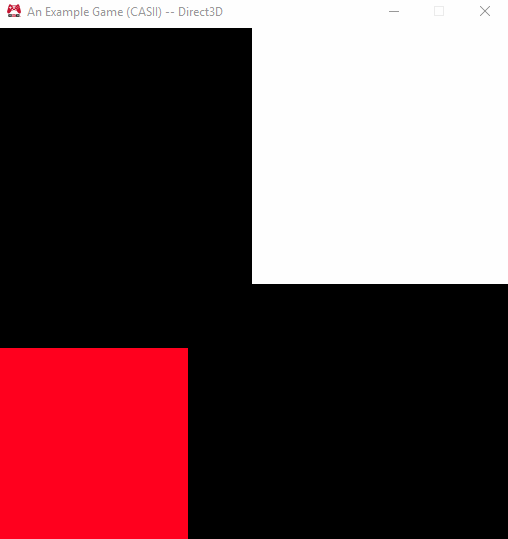
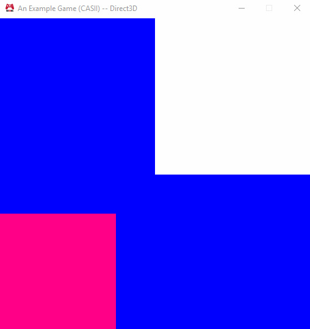

# Assignment 3
### That was quick!

The objectives of Assignment 3 were to continue with the abstraction of code we had started in the previous assignment.  All of the `Graphics.cpp` file would need to be platform independent and make calls to interfaces that handled platform specific functionality (i.e. the D3D `InitializeViews` I mentioned in the previous write-up).  In addition to making the Graphics Facade completely platform independent, we would need to modify our interfaces for our `Effect` and `Sprite` classes to take platform-independent initialization parameters.  Finally, our last objective of this assignment was to merge the D3D and OpenGL shader variant files into a single shader file.

## Purpose

This assignment shares some of the purpose from the previous one:  abstracting the Graphics project in such a manner to prepare it for a multi-purpose future.  Much of what was required of us involved modifying the existing interface and adding more interfaces to make the code more modular and workable.  While the objective was framed as aiming for cross-platform code, much of what I have done in this assignment prepares the Graphics project for changes we'll make in the future that will allow it to handle game specific data.

And other objectives support this: namely the alteration of our `Sprite` and `Effect` interfaces.  The changes required were specifically "initialization" changes.  As proof of having multipurpose `Sprite` and `Effect` classes, we'd need to render two different sprites using two different effects.

Finally, the last objective of merging the shaders together was a simple one that will undoubtedly prepare us for a future assignment and will simplify the creation of shaders (since a developer using the engine would only have to write a single shader).

## Further Abstracting the Graphics Facade

All in all, I created the following additional files:

* `cScreen.h`, `cScreen.cpp`, `cScreen.gl.cpp`, & `cScreen.d3d.cpp`
* `sInitParams.h`
* `sColor.h`

Additionally, I removed the `Graphics.gl.cpp` and `Graphics.d3d.cpp` platform specific files as we were not allowed to have any platform specific `Graphics` files or use of macros in the `Graphics.*` files, per assignment rules.  This kinda made my plans mentioned in the previous write-up of having a function called `InitializePS` in the Graphics namespace whose purpose would be to be implemented in platform specific cpp files such as `Graphics.d3d.cpp` an option I couldn't implement.

Instead, I opted into creating a `Screen` abstraction.  This abstraction merely models a render target that can be cleared and contains a front and back buffer which can be swapped out.  I couldn't really think of anything better to call it than `Screen`.. even though it's not actually the user's game Window.  Still, I feel its suitable enough given its current functionality.

The platform specific implementation is in the platform specific cpp files.  `cScreen.gl.cpp` contains the OpenGL specific code while `cScreen.d3d.cpp` contains the Direct3D specific code.

The `sInitParams.h` header file merely extracts the `sInitializationParameters` struct from the `Graphics.h` header file.. since the struct is defined using platform macros (such as `EAE6320_PLATFORM_D3D`) and we're not allowed any of those in `Graphics.h`.  (I'm not sure if this was needed, but I wanted to be on the safe side and just relocate it to its own file.)

Finally, I created a simple `sColor.h` header file to contain a struct which packages four floats together to define a color value.  It doesn't have much functionality right now, but it is used to tell the Graphics facade (and, consequently, the `Screen`) what color to clear with.  I modified the `RenderFrame` function in the Graphics namespace to take a `sColor` struct as an argument.  Additionally, there's an overloaded version that takes no arguments and renders the frame with the color black.

Actually clearing the color looks like this inside the `Graphics.cpp` file:

`s_screen.Clear(i_color);`

The screen handles the platform dependent ways of clearing the current render target.  There's a similar looking method for swapping the front and back buffers as well. :D

## Sprite and Effect

This was actually pretty simple.. and half of it I already had done!  The first half of the goal was to modify the `Sprite` interface so that one could declare multiple Sprites for rendering without needing to specify the quad's vertices each time.  A similar requirement was had for creating `Effect`s with different shaders... and I already had that set up! :D

The end result was the following initialization call for the `Sprite` class:

``` c++
eae6320::Graphics::SpriteBounds bounds{ 0.0F, 1.0F, 1.0F, 1.0F };
if (!(result = s_sprite[0].Create(bounds))) {
	EAE6320_ASSERT(false);
	goto OnExit;
}
```

You can ignore most of the "was this call successful?" code.  The important part is the instantiation of the `SpriteBounds` object that defines where the sprite is positioned on screen.  Then the call to `Sprite::Create(SpriteBounds)` which does the actual setup of the Sprite and readies the object to actually be rendered.  Specifically it takes four floats: the upperLeftX coordinate of the quad, the upperLeftY coordinate of the quad, the width of the quad, and the height of the quad.

As to my `Effect` initialization code.. well, here's how it looked last week (or very similar, anyways):

``` c++
if (!(result = s_effect[0].Create(
	"data/Shaders/Vertex/sprite.shd",
	"data/Shaders/Fragment/sprite.shd"
))) {
	EAE6320_ASSERT(false);
	goto OnExit;
}
```

Again, there's a lot of "was this call successful?" code.. but the important part is the call to `Effect::Create` which takes two string literals; one of them is the path from the current working directory to the vertex shader, and the other is the same but for the fragment shader.

I should point out, that since this assignment required having two separate `Sprite`s and `Effect`s that I simply converted the previous `s_sprite` and `s_effect` static objects into static arrays to hold the two.  I found this preferable to having a `s_sprite1` and so on.

## Single Shader Magic

This objective played heavily into what I mentioned back in write-up one; namely, that we'll be merging the shaders into a single "shader" which would then be processed into a platform specific shader as necessary.  The suggested method of handling this was to simply surround the HLSL and GLSL shaders with preprocessor macros in a single file:

``` c++
#define EAE6320_PLATFORM_GL

// ...

#if defined( EAE6320_PLATFORM_D3D)
    // HLSL Here
#elif defined( EAE6320_PLATFORM_GL )
    // GLSL Here
#endif
```

This would have worked.. but I noticed the `Shaders/shaders.inc` file..  and was surprised that a lot of work for setting up what I'm calling PPSL (or Pre-Processed Shader Language) was already done!  And.. that I could now do one of the Optional Challenges from Assignment 1.  As well as a bunch of other things..

Anyway, after about a half hour of work, my shaders were extremely compact and "streamlined" and I wasn't using the method above!  Instead, to give you an example (that shouldn't give too much away), my `Fragment/Sprite.ppsl` looks like this:

``` c++
#include <Shaders/shaders.inc>

MainFragment
{
	o_color = vec4(1, 1, 1, 1);
}
```

How awesome is that, huh? :D  That's a fragment shader that is convertible via the "Shader Builder" project into both HLSL and GLSL via voodoo magic that is hidden inside the `<Shaders/shaders.inc>` file, which I can't show you right now. :P

## Wrapping Up

And that's all folks!  This assignment took me much less time than I expected and I still did a bit more than the required objectives.  (I even completed the Optional Challenge of using Triangle Strips.. which wasn't really that difficult at all. :P )  And so, to wrap everything up, here's some screenshots and a download link:





[Windows - Release - Direct3D](https://github.com/CorneliaXaos/EAE6320-WriteUps/releases/download/a3/Assignment3.zip)

~ Cornelia Schultz
