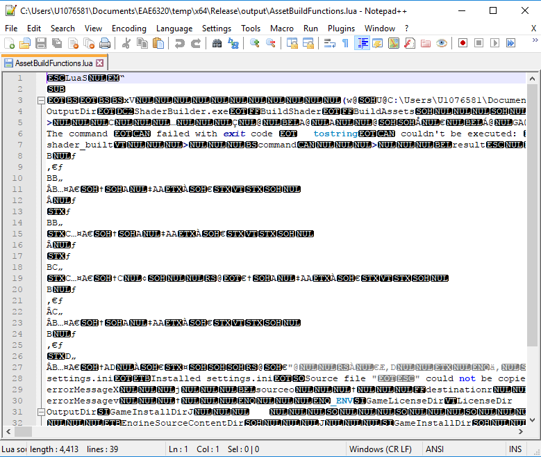
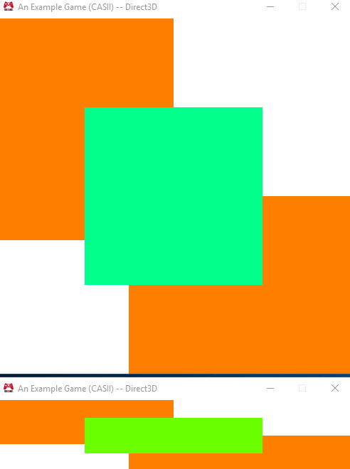

# Assignment 5
### I <3 Lua!!

The objectives of this assignment were to integrate code provided by the professor into our AssetBuildExe and AssetBuildLibrary projects.  The majority of this code was provided for us, but there were sections of it that needed to be filled in.  (Primarily sections of code interacting with the Lua C runtime.)

The other aspect of this assignment involved creating a new asset in our project, the `settings.ini` user configuration file, and ensuring that it would be delivered with our application build.

## Purpose

I believe that the purpose of this assignment was to prepare our build pipeline for more complex data.  We are slowly working our asset build code from C++ to being in some kind of data-driven format (i.e. the best format).  Asset building (such as compiling the shaders) were specified in C++ code, but now are specified in Lua.  The Lua code, however, still calls the ShaderBuilder project to do the actual building, but the specific shaders we want to build are specified in an Interpreted Language now instead of a compiled one.

In the future, I expect that the data used to indicate to the build pipeline which assets should be built will be moved entirely into other data files, and using Lua to do that is one way to create a more eloquent build pipeline.

## Lua Asset Building

As I mentioned earlier, we were provided with the majority of the code used to replace our old implementations of AssetBuildExe and AssetBuildLibrary.  I had previously edited the AssetBuildExe code in order to simplify my building of shaders, and I would have lost all of the code I used to simplify shader building...

... but, I just relocated the code into Lua itself!  Basically, I transliterated the code from c++ into lua in order to build the shaders the same way I currently am but from a lua context instead of a C++ context!  This allows me to declare a simple table of data describing a shader and ask lua to build it.  Currently, those tables are inside of the `AssetBuildFunctions.lua` file itself rather than being read in from some kind of manifest.

In addition to integrating my old code with the new pipeline, I had to complete several functions that interacted with Lua.  This was actually quite simple as I had used the Lua C API before.  There were some new calls I wasn't familiar with, but it was relatively simple to look up what functions were needed in the API reference (and, by using the "Using Lua" example project we were also provided with as an additional reference).  The hardest part was following the code path back and forth across the Lua / C layer and figuring out what was needed to be returned from a particular function (or even where it was being called from).

In the end, though, I managed to integrate the `AssetBuildFunctions.lua` library into the solution's build pipeline.  In Debug builds, it merely copies the file to the output directory for use by the C++ code.  For release versions, it uses the Lua compiler to generate bytecode that can be loaded more efficiently into the runtime (since it doesn't have to parse the data when reading the file).  The end result is something that looks like this:

Yea.. not human readable at all.. but it is much more efficient for the Lua interpreter to load and execute.  The compilation process probably also optimizes your functions some, though I wouldn't know for sure.  The only disadvantage of using compiled lua files that I can think of is that if you were to integrate Lua as a scripting language in your game and deliver the files to your users, this would impede users from modding or understanding your game (though I imagine a decompiler exists..).

## settings.ini

This portion of the assignment was a piece of cake.  After looking at the User Settings project for a brief moment I discovered we weren't working with actual Windows Configuration "ini" files..  Rather, we were renaming a Lua file to an "INI" file and treating it like lua code... and basically using the global table space of that lua file to define user configuration parameters.

The game currently only supports two configuration parameters:  the game window's starting width and starting height.  All that was really required for this portion was to make sure that the `AssetBuildFunctions.lua` code correctly "built" the `settings.ini` file and exported it into the output directory for the game.  (The code for reading in settings information has been in the code base since Assignment 1 and I'm pretty sure that it would likely work if you created an ini file for the older builds.)

In the end, you can now do stuff like this:

(Note, I'm running two instances that were initialized to different sizes.)

One thing should be mentioned about the `settings.ini` file..  We don't compile it like we do the `AssetBuildFunctions.lua` file.  This is primarily because a user reading the gibberish above would not really be able to edit the file and set a preferred resolution (or any other settings we add in the future).  Obviously, this code needs to be in a human readable format.

## Wrapping Up

And that's all.  Here is the download for this iteration of the project (though much has not really changed from the user's perspective).

[Windows - Release - Direct3D](https://github.com/CorneliaXaos/EAE6320-WriteUps/releases/download/a5/Assignment5.zip)

~ Cornelia Schultz
