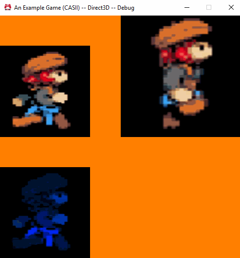

# Assignment 6
### It's Starting to Get a Bit Game-y

So this assignment had us add some additional code to our engines in order to support the drawing of textures!  Specifically, we had to add texture support by merging some new code into our existing engine to support the building and utilization of textures.  Our Graphics project's code needed to be amended to support the assignment of UVs to a Sprite as well as submitting textures from the Game project for rendering.  Finally, in order to more properly show off what we accomplished, we needed to add some user interaction and time-based updates to the output display.

## Purpose

It's harder to see the forest for the trees here.  Namely, it seems like the purpose of this assignment was just to add another module / bit of functionality to our game engine without any deep underlying goal other than to do just that.  Previous assignments seemed like they were building up to something, but this assignment seems like its primary goal was just to add a feature required for just about any game engine (unless you're making one of those awesome text adventures, of course.. :P ).

Still, completing this assignment would have given a bit of a glimpse into just how troublesome cross-platform rendering can be..  Namely, with the differences between the two biggest render drivers, OpenGL and D3D.

## The Assignment

Overall, this assignment wasn't difficult.. it just took much more time than I expected.  I started with implementing the Texture Build support, and I set it up to work similar to how my Shader Build support functions.  I momentarily considered merging the two functions I had into one given how similar their structure was.. but decided it wasn't worth doing for this assignment.

Next, I needed to update my shaders.. and managed to preserve my very, very nice crossplatform build support by creating two new "shader include" files!  Specifically, I created a `sprites.inc` include file for handling Shaders that specifically are Sprite shaders (it defines a couple of "Main" macros for Sprite vertex and fragment shaders).  I also created a `textures.inc` include file which adds some useful macros for handling the declaration of uniform samplers and then sampling them on both platforms.

The next two steps took place entirely in the game engine (while the first was in Lua and the second in "PPSL").  I set up some structure in the Example Game project to create the texture objects at runtime.  Following, I modified the Graphics project to allow submitting a texture along with any render job.  This will **very likely** be replaced later with a proper `Material` class.  To make that obvious, I called the Texture handle that I store in the Renderjob "`material`" in code.

## The Wonderful World of UVs

When I was adding UV support to my sprite I decided I would add the ability to specify them as part of the SpriteBuilder (formerly called "SpriteFactory") implementation I had.  One does not need to specify them when building a sprite as the "defaults" will be used to make  any texture span the full width and height of the sprite perfectly.  These are easy to calculate without the user having to supply values. We simply use the normalized texture coordinates as the UVs.  That is to say, we have the UVs for our sprite be the four following coordinate pairs:

| OpenGL UVs  | u | v |
| ----------- |---|---|
|Lower Left   | 0 | 0 |
|Upper Left   | 0 | 1 |
|Lower Right  | 1 | 0 |
|Upper Right  | 1 | 1 |

While I was designing this system I spotted myself duplicating code from the `SpriteBounds` struct I had... So I abstracted everything out into a single `Rect` struct.  This struct takes a single 'x / y' coordinate pair and a width and height to define a rectangle in space.  (The 'x / y' coordinate is considered the lower-left corner of the `Rect`.)  I also added a lot of helper functions for obtaining a point in space directly from the rect based on which corner it was.  This encapsulated the math for the `Rect` inside of the class itself, which was a nice plus.

But, of course, OpenGL and D3D handle things slightly differently.. and the V coordinate of the UV pair differs in how its specified on each platform.  In OpenGL, V increases as one goes from the bottom of an image to the top of an image..  In D3D, it's the opposite and V behaves like the 'y' coordinate in standard GUI toolkits (it increases from top to bottom).

Luckily, I'm familiar with a very simple solution for converting between the two:

`UVs_D3D = 1 - UVs_GL`

Thus, all I had to do in order to convert from OpenGL style UVs to D3D UVs is to subtract the OpenGL UVs from 1 and a correct result would be produced!  The `Rect` struct I created essentially defines UVs in an OpenGL-styled way, and, therefore, in the `cSprite.d3d.cpp` file I assigned the UV coordinates as follows:

```c++
// inside the initialization function
// one of the parameters is: const Rect& uvs

vertexData[0].v = 1 - uvs.LowerLeft().y;

// and similar for the other vertices
```

## Texture Reference Counting

So..  We were required to pass a "Handle" to our texture objects around inside the engine rather than working with raw Texture pointers that were reference counted.  Curiously, the Texture Handle object does not have a function to increase the reference count of the Texture it references.  This is definitely not something I would have done...  Though I can reason why...

Specifically, it could allow for Handles to things that are not reference counted.. but that doesn't actually work as, internally, when Handles are released it decrements the objects reference count..  Thus, the only other logical conclusion I could come up with is that the Handle interface was kept as simple as possible.  They are merely "keys" to an object and have no dictation over that objects lifetime.  This can make things simple.. but it can also lead to headaches when one first works with Handles..

Namely, when one has to manually increment the reference it makes sense that one should also **have to** *manually* decrement the reference.  This leads to a balanced code flow...  However, this is not the case with handles.  One should **not** manually decrement the reference.  One should call the appropriate `Manager::Release(Handle)` function... or one will face a lot of bugs..

Namely, the Manager will not properly clean up the Asset tracking code, and will throw asserts on shutdown.  It took me a while to figure this out as I skipped over the "Submission Requirements" section of the assignment (I always read it after completing the assignment since it details what goes into the write up).  If I had read it, I would have noticed this:

> Why do you have to use the handle-provided way to decrement the reference count after rendering is done? (What happens if you don't use the provided way and instead manually decrement the count? It may help to actually try manually decrementing it and seeing what happens, and then try to figure out why.)

Well.. I've clearly answered that above, but to elaborate:  if one doesn't use the Release function then the Manager will never clean up the Asset reference it holds as it only does so when the Reference count reaches 0.  Further, the actual call to the Release function back in the ExampleGame project is called before the Handles in the Graphics project are actually cleaned up..  Meaning you should expect assertions to fail when the Manager is statically cleaned up during code shutdown.

Why don't I like this?  Well, as I mentioned, if one has to manually increment the reference one expects to manually decrement it.  This is a sort of.. "balanced thinking" that makes programs easier to follow.  The requirements this implementation imposes breaks this thought pattern.

Why should one have to `Release` something if they never `Acquire`d it in the first place?  I almost implemented said `Acquire` function just because of that very reason.

## Project Dependency

Finally, in the setting up of the dependencies, there was a project that needed a dependency in order to ensure that things built in the correct order.  Without the dependency added, the RNG gods decided that the TextureBuilder project would be built last (in my particular case).  This meant that the TextureBuilder.exe wouldn't be available to the AssetBuildExe project and, consequentially, to the AssetBuildLibrary code that actually made the call to the executable file during build time.

Personally, I would have made the Texture Builder project a dependency of the AssetBuildLibrary or AssetBuildExe project.  After all, the TextureBuilder is essentially being called by one of those projects directly / indirectly.  But, we were hinted at the ShaderBuilder project.  It's being used in exactly the same way.

So I did a little deduction and reasoned that, in order for assets to be built properly, the TextureBuilder project would need to be built first..  And which project builds the game's assets?  Why the "BuildExampleGameAssets" project, of course.  So I opened up the dependencies for that project, and, lo and behold, one of its dependencies was the ShaderBuilder so I knew I had made the right choice.

## Conclusion

To wrap things up, that was a very interesting assignment.  It took me much longer than expected to do, but in the end it came together nicely.  As usual, here's an animated gif of the project so far and a download.



(You can see in the gif that the sprite in the upper left is being toggled randomly.  I am pressing the "F1" key to do that toggling.  Additionally, the sprite in the upper right is cycling through 4 different textures every second, or one texture every 0.25 seconds.)

[Windows - Release - Direct3d](https://github.com/CorneliaXaos/EAE6320-WriteUps/releases/download/a6/Assignment6.zip)
