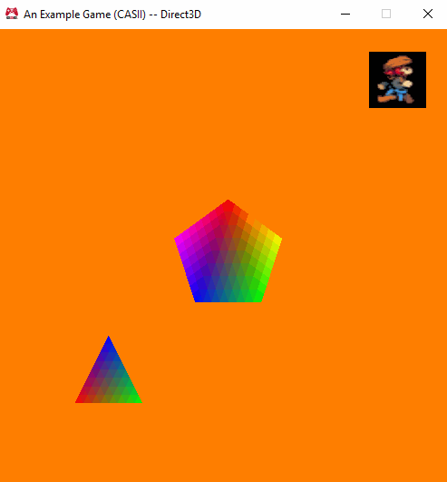

# Assignment 8
### This One Took Some Time

This assignment took me much longer than the previous one.. but not because it was difficult..  Rather, there was just so much that needed to be done!  Specifically.. we had to add *Mesh Support* to our engine!  This seems like a simple task.. and in a way it was.  (The only real difference between Sprites and Meshes is how we use them in the engine; behind the scenes, they do very similar things.)

In addition to adding Mesh Support, we needed to change the Example Game project to show off the internal changes.  Specifically, we needed to display two meshes, and one of them needed to be player controllable!

## Purpose

This assignment is (almost) the final step needed to be able to get the Engine to a point where one could make a game with it.  Meshes will represent all the geometry within the engine that make up the game world.  Sprites are exclusively being used for UI geometry.  Proper mesh support is required so our players can have a game world to interact with.

## Mesh Support

This is where the bulk of the time was spent.  Using my `Sprite` class as a reference, I created a `Mesh` class.  Most of the code between the two is very similar..  The differences are primarily the type of Vertex Data, the types of Graphics Primitives being rendered (Triangles versus Triangle Strips), and the fact that the `Mesh` class uses an Index Buffer.  A `VertexFormat` for the `Mesh` class also had to be created.

In addition to creating the `Mesh` class, I needed to create a few helper classes:  the `MeshBuilder` and the `MeshJob` classes.  The `MeshBuilder` class serves as an analogue to the `SpriteBuilder` and `EffectBuilder` classes.  Its function is to allow the user to incrementally construct a Mesh from index and vertex data.  I added numerous functions that made sense, some of which I wasn't sure would be useful.. until I had to create a mesh by hand in the Example Game project.  It was surprisingly easy.  As to the `MeshJob` class.  This is a `RenderJob` used by the Graphics project to cache `Mesh` data for rendering.

Speaking of the Graphics Project, the only other task needed to add Mesh Support was adding a `Mesh` submission function to the `Graphics` namespace.  This function takes an `Effect`, a `Mesh`, and a `eae6320::Math::sVector` (a position) in order to render a `Mesh` to the screen.

I also made some additional tweaks to the rendering function in order to ensure that UI / HUD stuff (i.e. `Sprite`s) were rendered **after** `Mesh`es.

## Example Game Updates

### Mesh Generation

A large portion of the Example Game updates included removing most of the old Sprites.  (You'll find their textures are still present in the release file.  I may add the animation back in at some point.)  This was relatively simple.  What encompassed the majority of the work was creating and adding in `Mesh` objects!

I create two meshes in the initialization code.  A regular triangle, and a regular pentagon.  (The math for the latter was fun to look up. :P )  This was made surprisingly easy due to my `MeshBuilder` class, as I mentioned previously.

I should note that the vertices are passed to the `MeshBuilder` in a "right handed" way.  That is to say the vertices are given to the builder in a right-handed coordinate system.  OpenGL expects right-handed vertices...  Direct3D does not.  Direct3D expects left-handed vertices..  So how do I fix this?

Well..  inside of `Mesh.d3d.cpp`, before it sends the IndexBuffer to the graphics card.. it reverses it!  A single call to `std::reverse` with the appropriate parameters allows me to flip the IndexBuffer around.  This reverses the "handedness" of the triangles the indices represent, effectively converting them from a right-handed coordinate system to a left-handed one.. Easy!

### Mesh Updating

One of the two meshes is controllable by the user (the pentagon).  This was done by using the two update functions provided by the `Application` base class:  `UpdateSimulationBasedOnInput` and `UpdateSimulationBasedOnTime`.

In the former, the keyboard input is read to determine if the user is pressing any of the arrow keys.  It then uses the results of those polls to set an `sVector` used to track the pentagon's velocity.  Why we use velocity instead of just updating the pentagon's position directly will be explained in the next section.

In `UpdateSimulationBasedOnTime`, we use the velocity to actually set the position.  This is simple enough to do as the signature of this function provides a time delta we can use to perform some simple integration to get the pentagon's current position.

### Mesh Rendering

Rendering meshes was simple.  A single call to the `Graphics::SubmitMesh` function with the appropriate parameters.  A "renderMesh" `Effect`, a position, and the `Mesh` pointer itself.  This would be fine for the static mesh (the triangle) since it doesn't move..

But if we used the position of the pentagon directly the movement of the Pentagon would be jerky!  This is because the simulation only updates every fifteenth of a second.. but the game is rendering **much** faster than that!  So much so that the pentagon would appear to skip across the screen, making little jumps..  that doesn't look good!

So.. how do we fix it?  Well.. why did we use velocity above?  The solution to our rendering problem is to use the velocity we have for our object to predict where it **should** be!  By using the velocity, and the conveniently named parameter to the `SubmitDataToBeRendered` function, `i_elapsedSecondCount_sinceLastSimulationUpdate` (such a long parameter name...), we can use the velocity to predict where the pentagon should be and draw it there instead of where the simulation says it is (because the simulation is out of date by some not-insignificant amount of time).

## Wrapping Up

And that was this assignment!  As usual, here's an animated gif showing the game in action as well as the download link.  To control the pentagon, you can use the arrow keys.

(I should note, the odd quantization on the pentagon and the triangle is due to the gif image format's limited color palette..  It only allows up to 256 colors and the full quality version of those meshes easily exceed that. :P )

[Windows - Release - Direct3D](https://github.com/CorneliaXaos/EAE6320-WriteUps/releases/download/a8/Assignment8.zip)
